# Effects 100 - 150

|    | ID | Name | Desc |
|----|----|------|------|
|  | 100 | EF_REMOVETRAP | Yellow ball fountain |
|  | 101 | EF_REPAIRWEAPON | Weapon Repair |
| 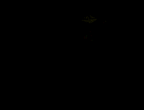 | 102 | EF_CRASHEARTH | Hammerfall |
| 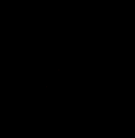 | 103 | EF_PERFECTION | Weapon Perfection |
|  | 104 | EF_MAXPOWER | Maximize Power |
|  | 105 | EF_BLASTMINE | (nothing) |
| 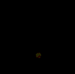 | 106 | EF_BLASTMINEBOMB | Blast Mine Trap |
| 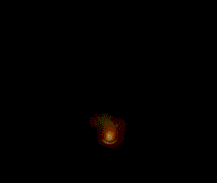 | 107 | EF_CLAYMORE | Claymore Trap |
| 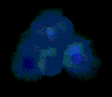 | 108 | EF_FREEZING | Freezing Trap |
| 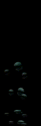 | 109 | EF_BUBBLE | Bailaban Blue bubble Map Effect |
| 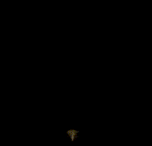 | 110 | EF_GASPUSH | Trap Used by Giearth |
| 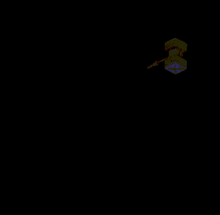 | 111 | EF_SPRINGTRAP | Spring Trap |
| 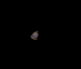 | 112 | EF_KYRIE | Kyrie Eleison |
|  | 113 | EF_MAGNUS | Magnus Exorcismus |
| 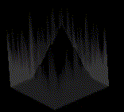 | 114 | EF_BOTTOM | Old Magnus Exorcismus Map Unit (unused) |
| 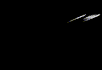 | 115 | EF_BLITZBEAT | Blitz Beat |
| 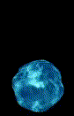 | 116 | EF_WATERBALL | Fling Watersphere |
| 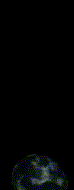 | 117 | EF_WATERBALL2 | Waterball |
| 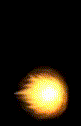 | 118 | EF_FIREIVY | Fling Firesphere |
| 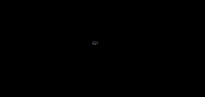 | 119 | EF_DETECTING | Detect |
|  | 120 | EF_CLOAKING | Cloaking |
| 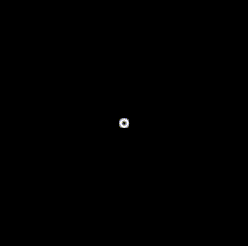 | 121 | EF_SONICBLOW | Sonic Blow (Part 1/2) |
| 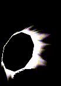 | 122 | EF_SONICBLOWHIT | Multi hit effect |
| 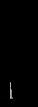 | 123 | EF_GRIMTOOTH | Grimtooth Cast |
| 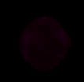 | 124 | EF_VENOMDUST | Venom Dust |
| 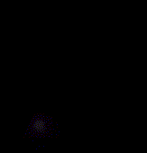 | 125 | EF_ENCHANTPOISON | Enchant Poison |
| 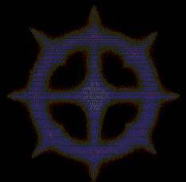 | 126 | EF_POISONREACT | Poison React |
| 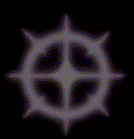 | 127 | EF_POISONREACT2 | Small Posion React |
|  | 128 | EF_OVERTHRUST | Over Thrust |
| 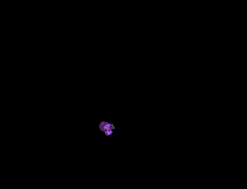 | 129 | EF_SPLASHER | Venom Splasher Explosion |
| 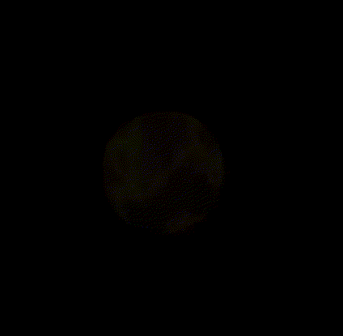 | 130 | EF_TWOHANDQUICKEN | Two-Hand Quicken |
| 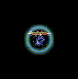 | 131 | EF_AUTOCOUNTER | Auto-Counter Hit |
|  | 132 | EF_GRIMTOOTHATK | Grimtooth Hit |
|  | 133 | EF_FREEZE | Ice Effect (Used by NPCs) |
| 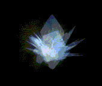 | 134 | EF_FREEZED | Ice Effect (Used by NPCs) |
| 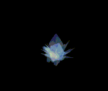 | 135 | EF_ICECRASH | Ice Effect (Used by NPCs) |
| 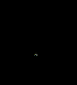 | 136 | EF_SLOWPOISON | Slow Poison |
| 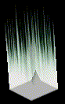 | 137 | EF_BOTTOM2 | Old Sanctuary Map Unit (unused) |
| 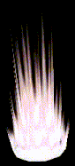 | 138 | EF_FIREPILLARON | Fire pillar |
| 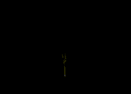 | 139 | EF_SANDMAN | Sandman Trap |
| 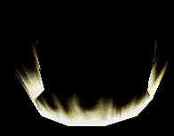 | 140 | EF_REVIVE | Ressurection Aura |
| 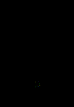 | 141 | EF_PNEUMA | Pneuma |
| 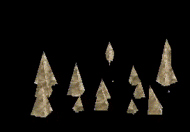 | 142 | EF_HEAVENSDRIVE | Heaven's Drive |
| 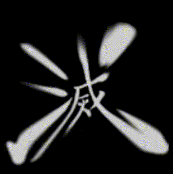 | 143 | EF_SONICBLOW2 | Sonic Blow (Part 2/2) |
| 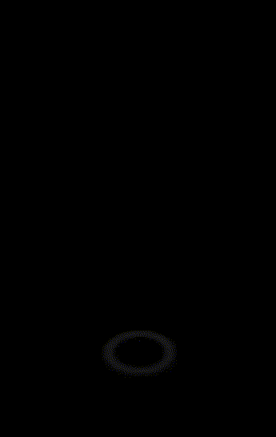 | 144 | EF_BRANDISH2 | Brandish Spear Pre-Hit Effect |
| 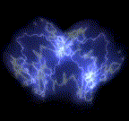 | 145 | EF_SHOCKWAVE | Shockwave Trap |
| 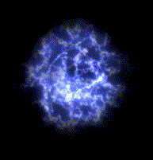 | 146 | EF_SHOCKWAVEHIT | Shockwave Trap Hit |
| 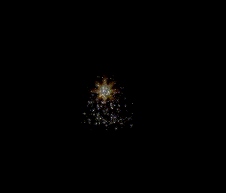 | 147 | EF_EARTHHIT | Pierce Hit |
| 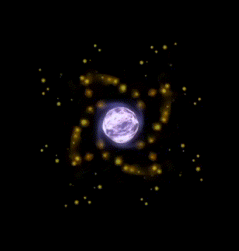 | 148 | EF_PIERCESELF | Pierce Cast Animation |
| 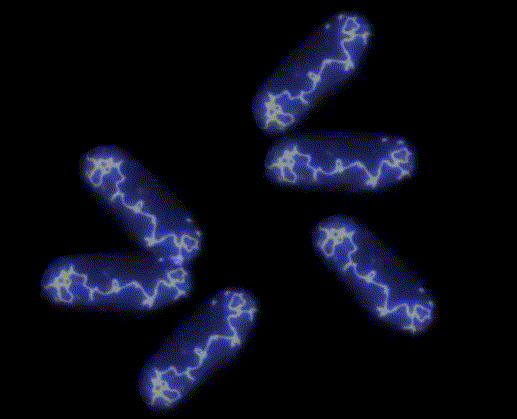 | 149 | EF_BOWLINGSELF | Bowling Bash |
