# Effects 150 - 200

|    | ID | Name | Desc |
|----|----|------|------|
| 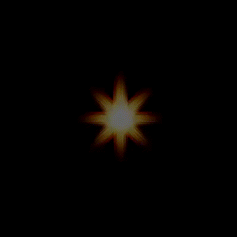 | 150 | EF_SPEARSTABSELF | Pierce Cast Animation |
| 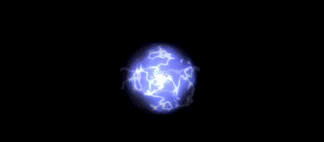 | 151 | EF_SPEARBMRSELF | Spear Boomerang Cast |
| 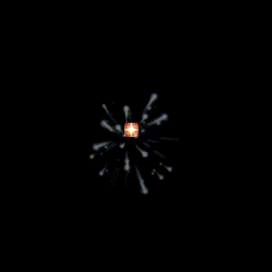 | 152 | EF_HOLYHIT | Turn Undead |
| 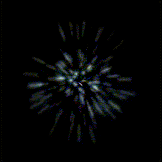 | 153 | EF_CONCENTRATION | Increase Concentration |
| 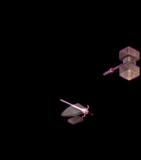 | 154 | EF_REFINEOK | Refine Success |
| 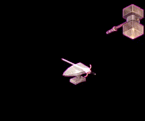 | 155 | EF_REFINEFAIL | Refine Fail |
|  | 156 | EF_JOBCHANGE | jobchange.str not found error |
|  | 157 | EF_LVUP | levelup.str not found error |
|  | 158 | EF_JOBLVUP | Job Level Up |
|  | 159 | EF_TOPRANK | PvP circle |
|  | 160 | EF_PARTY | PvP Party Circle |
|  | 161 | EF_RAIN | (Nothing) |
|  | 162 | EF_SNOW | Snow |
|  | 163 | EF_SAKURA | White Sakura Leaves |
|  | 164 | EF_STATUS_STATE | (Nothing) |
|  | 165 | EF_BANJJAKII | Comodo Fireworks Ball |
|  | 166 | EF_MAKEBLUR | Energy Coat (Visual Effect) |
|  | 167 | EF_TAMINGSUCCESS | (Nothing) |
|  | 168 | EF_TAMINGFAILED | (Nothing) |
| 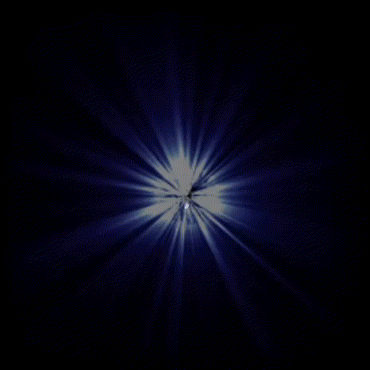 | 169 | EF_ENERGYCOAT | Energy Coat Animation |
|  | 170 | EF_CARTREVOLUTION | Cart Revolution |
| 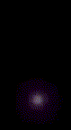 | 171 | EF_VENOMDUST2 | Venom Dust Map Unit |
|  | 172 | EF_CHANGEDARK | Change Element (Dark) |
|  | 173 | EF_CHANGEFIRE | Change Element (Fire) |
|  | 174 | EF_CHANGECOLD | Change Element (Water) |
|  | 175 | EF_CHANGEWIND | Change Element (Wind) |
|  | 176 | EF_CHANGEFLAME | Change Element (Fire) |
|  | 177 | EF_CHANGEEARTH | Change Element (Earth) |
|  | 178 | EF_CHAINGEHOLY | Change Element (Holy) |
|  | 179 | EF_CHANGEPOISON | Change Element (Poison) |
| 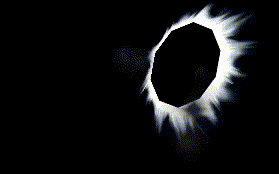 | 180 | EF_HITDARK | Darkness Attack |
| 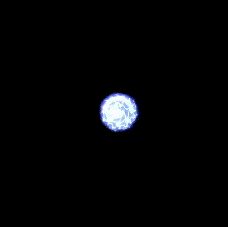 | 181 | EF_MENTALBREAK | Mental Breaker |
| 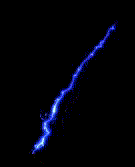 | 182 | EF_MAGICALATTHIT | Magical Hit |
| 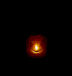 | 183 | EF_SUI_EXPLOSION | Self Destruction |
|  | 184 | EF_DARKATTACK | (Nothing) |
|  | 185 | EF_SUICIDE | (Nothing) |
| 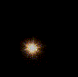 | 186 | EF_COMBOATTACK1 | Combo Attack 1 |
|  | 187 | EF_COMBOATTACK2 | Combo Attack 2 |
| 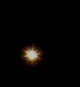 | 188 | EF_COMBOATTACK3 | Combo Attack 3 |
| 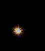 | 189 | EF_COMBOATTACK4 | Combo Attack 4 |
|  | 190 | EF_COMBOATTACK5 | Combo Attack 5 |
| 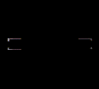 | 191 | EF_GUIDEDATTACK | Guided Attack |
| 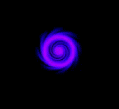 | 192 | EF_POISONATTACK | Poison Attack |
|  | 193 | EF_SILENCEATTACK | Silence Attack |
|  | 194 | EF_STUNATTACK | Stun Attack |
| 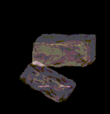 | 195 | EF_PETRIFYATTACK | Petrify Attack |
|  | 196 | EF_CURSEATTACK | Curse Attack |
| 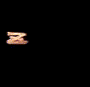 | 197 | EF_SLEEPATTACK | Sleep Attack |
|  | 198 | EF_TELEKHIT | (Nothing) |
|  | 199 | EF_PONG | Small Popping Bubble Map Effect |
