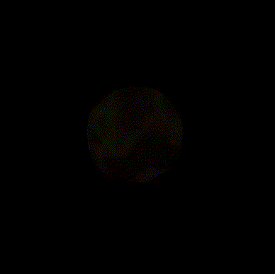
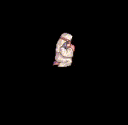
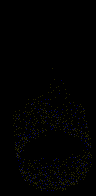
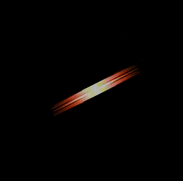
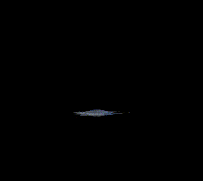
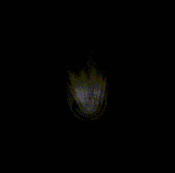
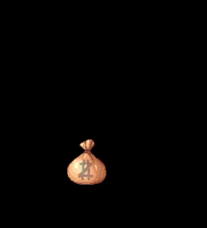
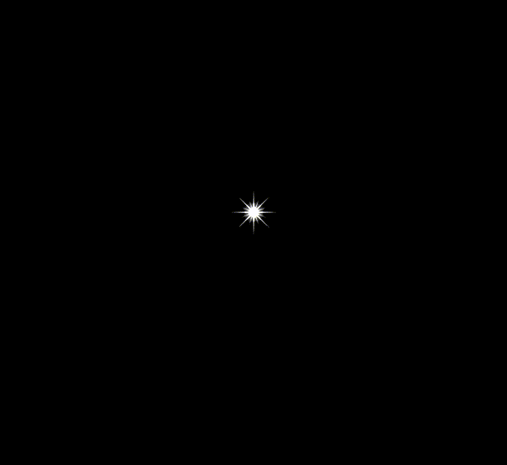

# Effects 250 - 300

|    | ID | Name | Desc |
|----|----|------|------|
|  | 250 | EF_SPEARQUICKEN | Spear Quicken |
|  | 251 | EF_DEVOTION | Devotion |
|  | 252 | EF_REFLECTSHIELD | Reflect Shield |
|  | 253 | EF_ABSORBSPIRITS | Absorb Spirit Spheres |
|  | 254 | EF_STEELBODY | Mental Strength (Visual Effect) |
|  | 255 | EF_FLAMELAUNCHER | Elemental Endow (Fire) |
|  | 256 | EF_FROSTWEAPON | Elemental Endow (Water) |
|  | 257 | EF_LIGHTNINGLOADER | Elemental Endow (Wind) |
|  | 258 | EF_SEISMICWEAPON | Elemental Endow (Earth) |
|  | 259 | EF_MAPPILLAR3 | Map Light Pillar Animation 3 |
|  | 260 | EF_MAPPILLAR4 | Map Light Pillar Animation 4 |
|  | 261 | EF_GUMGANG2 | Fury Cast Animation |
|  | 262 | EF_TEIHIT1 | Raging Quadruple Blow |
|  | 263 | EF_GUMGANG3 | Raging Quadruple Blow 2 |
|  | 264 | EF_TEIHIT2 | (Nothing) |
|  | 265 | EF_TANJI | Throw Spirit Sphere |
|  | 266 | EF_TEIHIT1X | Raging Quadruple Blow 3 |
|  | 267 | EF_CHIMTO | Occult Impaction |
|  | 268 | EF_STEALCOIN | Steal Coin |
|  | 269 | EF_STRIPWEAPON | Divest Weapon |
|  | 270 | EF_STRIPSHIELD | Divest Shield |
|  | 271 | EF_STRIPARMOR | Divest Armor |
|  | 272 | EF_STRIPHELM | Divest Helm |
|  | 273 | EF_CHAINCOMBO | Raging Quadruple Blow 4 |
|  | 274 | EF_RG_COIN | Steal Coin Animation |
|  | 275 | EF_BACKSTAP | Back Stab Animation |
|  | 276 | EF_TEIHIT3 | Raging Thrust |
|  | 277 | EF_BOTTOM_DISSONANCE | Dissoance Map Unit |
|  | 278 | EF_BOTTOM_LULLABY | Lullaby Map Unit |
|  | 279 | EF_BOTTOM_RICHMANKIM | Mr Kim a Rich Man Map Unit |
|  | 280 | EF_BOTTOM_ETERNALCHAOS | Eternal Chaos Map Unit |
|  | 281 | EF_BOTTOM_DRUMBATTLEFIELD | A Drum on the Battlefield Map Unit |
|  | 282 | EF_BOTTOM_RINGNIBELUNGEN | The Ring Of Nibelungen Map Unit |
|  | 283 | EF_BOTTOM_ROKISWEIL | Loki's Veil Map Unit |
|  | 284 | EF_BOTTOM_INTOABYSS | Into the Abyss Map Unit |
|  | 285 | EF_BOTTOM_SIEGFRIED | Invunerable Siegfriend Map Unit |
|  | 286 | EF_BOTTOM_WHISTLE | A Wistle Map Unit |
|  | 287 | EF_BOTTOM_ASSASSINCROSS | Assassin Cross of Sunset Map Unit |
|  | 288 | EF_BOTTOM_POEMBRAGI | A Poem of Bragi Map Unit |
|  | 289 | EF_BOTTOM_APPLEIDUN | The Apple Of Idun Map Unit |
|  | 290 | EF_BOTTOM_UGLYDANCE | Ugly Dance Map Unit |
|  | 291 | EF_BOTTOM_HUMMING | Humming Map Unit |
|  | 292 | EF_BOTTOM_DONTFORGETME | Please don't Forget Me Map Unit |
|  | 293 | EF_BOTTOM_FORTUNEKISS | Fortune's Kiss Map Unit |
|  | 294 | EF_BOTTOM_SERVICEFORYOU | Service For You Map Unit |
|  | 295 | EF_TALK_FROSTJOKE | Frost Joke |
|  | 296 | EF_TALK_SCREAM | Scream |
|  | 297 | EF_POKJUK | Fire Works (Visual Effect) |
|  | 298 | EF_THROWITEM | Acid Terror Animnation |
|  | 299 | EF_THROWITEM2 | (Nothing) |
