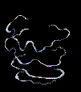

# Effects 450 - 500

|    | ID | Name | Desc |
|----|----|------|------|
|  | 450 | EF_GRANDCROSS2 | Darkcross |
|  | 451 | EF_SOULSTRIKE2 | Dark Strike |
|  | 452 | EF_YUFITEL2 | Something Like Jupitel Thunder |
|  | 453 | EF_NPC_STOP | Paralized |
|  | 454 | EF_DARKCASTING | Like Blind |
|  | 455 | EF_GUMGANGNPC | Another Warmth Lightning |
|  | 456 | EF_AGIUP | Power Up |
|  | 457 | EF_JUMPKICK | Flying Side Kick (2nd Part) |
|  | 458 | EF_QUAKEBODY2 | Running/Sprint (running into a wall) |
|  | 459 | EF_STORMKICK1 | Brown tornado that spins sprite (unused) |
|  | 460 | EF_STORMKICK2 | Green tornado (unused) |
|  | 461 | EF_STORMKICK3 | Blue tornado (unused) |
|  | 462 | EF_STORMKICK4 | Kaupe Dodge Effect |
|  | 463 | EF_STORMKICK5 | Kaupe Dodge Effect |
|  | 464 | EF_STORMKICK6 | White tornado (unused) |
|  | 465 | EF_STORMKICK7 | Purple tornado (unused) |
|  | 466 | EF_SPINEDBODY2 | Another Round Kick |
|  | 467 | EF_BEGINASURA1 | Warm/Mild Wind (Earth) |
|  | 468 | EF_BEGINASURA2 | Warm/Mild Wind (Wind) |
|  | 469 | EF_BEGINASURA3 | Warm/Mild Wind (Water) |
|  | 470 | EF_BEGINASURA4 | Warm/Mild Wind (Fire) |
|  | 471 | EF_BEGINASURA5 | Warm/Mild Wind (Undead) |
|  | 472 | EF_BEGINASURA6 | Warm/Mild Wind (Shadow) |
|  | 473 | EF_BEGINASURA7 | Warm/Mild Wind (Holy) |
|  | 474 | EF_AURABLADE2 | (Nothing) |
|  | 475 | EF_DEVIL1 | Demon of The Sun Moon And Stars (Level 1) |
|  | 476 | EF_DEVIL2 | Demon of The Sun Moon And Stars (Level 2) |
|  | 477 | EF_DEVIL3 | Demon of The Sun Moon And Stars (Level 3) |
|  | 478 | EF_DEVIL4 | Demon of The Sun Moon And Stars (Level 4) |
|  | 479 | EF_DEVIL5 | Demon of The Sun Moon And Stars (Level 5) |
|  | 480 | EF_DEVIL6 | Demon of The Sun Moon And Stars (Level 6) |
|  | 481 | EF_DEVIL7 | Demon of The Sun Moon And Stars (Level 7) |
|  | 482 | EF_DEVIL8 | Demon of The Sun Moon And Stars (Level 8) |
|  | 483 | EF_DEVIL9 | Demon of The Sun Moon And Stars (Level 9) |
|  | 484 | EF_DEVIL10 | Demon of The Sun Moon And Stars (Level 10) |
|  | 485 | EF_DOUBLEGUMGANG2 | Mental Strength Lightning but White |
|  | 486 | EF_DOUBLEGUMGANG3 | Mental Strength Lightning |
|  | 487 | EF_BLACKDEVIL | Demon of The Sun Moon And Stars Ground Effect |
|  | 488 | EF_FLOWERCAST | Comfort Skills |
|  | 489 | EF_FLOWERCAST2 | (Nothing) |
|  | 490 | EF_FLOWERCAST3 | (Nothing) |
|  | 491 | EF_MOCHI | Element Potions |
|  | 492 | EF_LAMADAN | Cooking Foods |
|  | 493 | EF_EDP | Enchant Deadly Poison |
|  | 494 | EF_SHIELDBOOMERANG2 | Throwing Tomahawk |
|  | 495 | EF_RG_COIN2 | Full Strip Sound |
|  | 496 | EF_GUARD2 | Preserve |
|  | 497 | EF_SLIM | Twilight Alchemy 1 |
|  | 498 | EF_SLIM2 | Twilight Alchemy 2 |
|  | 499 | EF_SLIM3 | Twilight Alchemy 3 |
