# Effects 500 - 550

|    | ID | Name | Desc |
|----|----|------|------|
|  | 500 | EF_CHEMICALBODY | Player Become Blue with Blue Aura |
|  | 501 | EF_CASTSPIN | Chase Walk Animation |
|  | 502 | EF_PIERCEBODY | Player Become Yellow with Yellow Aura |
|  | 503 | EF_SOULLINK | Soul Link Word |
|  | 504 | EF_CHOOKGI2 | (Nothing) |
|  | 505 | EF_MEMORIZE | Memorize |
|  | 506 | EF_SOULLIGHT | (Nothing) |
| 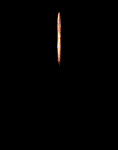 | 507 | EF_MAPAE | Authoritative Badge |
|  | 508 | EF_ITEMPOKJUK | Fire Cracker |
|  | 509 | EF_05VAL | Valentine Day Hearth (Wings) |
| 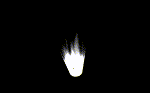 | 510 | EF_BEGINASURA11 | Champion Asura Strike |
|  | 511 | EF_NIGHT | (Nothing) |
| 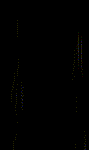 | 512 | EF_CHEMICAL2DASH | Chain Crush Combo |
| 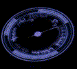 | 513 | EF_GROUNDSAMPLE | Area Cast |
|  | 514 | EF_GI_EXPLOSION | Really Big Circle |
| 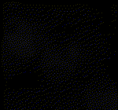 | 515 | EF_CLOUD4 | Einbroch Fog |
|  | 516 | EF_CLOUD5 | Airship Cloud |
|  | 517 | EF_BOTTOM_HERMODE | (Nothing) |
| 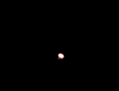 | 518 | EF_CARTTER | Cart Termination |
|  | 519 | EF_ITEMFAST | Speed Down Potion |
|  | 520 | EF_SHIELDBOOMERANG3 | Shield Bumerang |
|  | 521 | EF_DOUBLECASTBODY | Player Become Red with Red Aura |
| 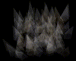 | 522 | EF_GRAVITATION | Gravitation Field |
|  | 523 | EF_TAROTCARD1 | Tarot Card of Fate (The Fool) |
| 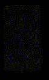 | 524 | EF_TAROTCARD2 | Tarot Card of Fate (The Magician) |
| 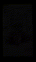 | 525 | EF_TAROTCARD3 | Tarot Card of Fate (The High Priestess) |
| 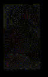 | 526 | EF_TAROTCARD4 | Tarot Card of Fate (The Chariot) |
| 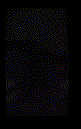 | 527 | EF_TAROTCARD5 | Tarot Card of Fate (Strength) |
| 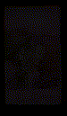 | 528 | EF_TAROTCARD6 | Tarot Card of Fate (The Lovers) |
| 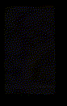 | 529 | EF_TAROTCARD7 | Tarot Card of Fate (The Wheel of Fortune) |
|  | 530 | EF_TAROTCARD8 | Tarot Card of Fate (The Hanged Man) |
| 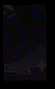 | 531 | EF_TAROTCARD9 | Tarot Card of Fate (Death) |
| 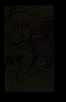 | 532 | EF_TAROTCARD10 | Tarot Card of Fate (Temperance) |
|  | 533 | EF_TAROTCARD11 | Tarot Card of Fate (The Devil) |
|  | 534 | EF_TAROTCARD12 | Tarot Card of Fate (The Tower) |
| 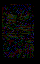 | 535 | EF_TAROTCARD13 | Tarot Card of Fate (The Star) |
| 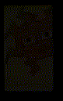 | 536 | EF_TAROTCARD14 | Tarot Card of Fate (The Sun) |
|  | 537 | EF_ACIDDEMON | Acid Demonstration |
|  | 538 | EF_GREENBODY | Player Become Green with Green Aura |
|  | 539 | EF_THROWITEM4 | Throw Random Bottle |
|  | 540 | EF_BABYBODY_BACK | Instant Small->Normal |
|  | 541 | EF_THROWITEM5 | (Nothing) |
|  | 542 | EF_BLUEBODY | KA-Spell (1st Part) |
|  | 543 | EF_HATED | Kahii |
|  | 544 | EF_REDLIGHTBODY | Warmth Red Sprite |
|  | 545 | EF_RO2YEAR | Sound And... PUFF Client Crash :P |
|  | 546 | EF_SMA_READY | Kaupe |
|  | 547 | EF_STIN | Estin |
|  | 548 | EF_RED_HIT | Instant Red Sprite |
|  | 549 | EF_BLUE_HIT | Instant Blue Sprite |
