# Effects 600 - 650

|    | ID | Name | Desc |
|----|----|------|------|
|  | 600 | EF_THROWITEM6 | Throw Venom Knife |
|  | 601 | EF_SIGHT2 | Sight Blaster |
|  | 602 | EF_QUAKEBODY4 | Close Confine (Grab Effect) |
| 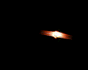 | 603 | EF_FIREHIT2 | Spinning fire ball (like 50, but smaller) |
| 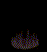 | 604 | EF_NPC_STOP2 | Close Confine (Ground Effect) |
|  | 605 | EF_NPC_STOP2_DEL | (Nothing) |
|  | 606 | EF_FVOICE | Pang Voice (Visual Effect) |
|  | 607 | EF_WINK | Wink of Charm (Visual Effect) |
| 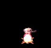 | 608 | EF_COOKING_OK | Cooking Success |
| 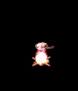 | 609 | EF_COOKING_FAIL | Cooking Failed |
|  | 610 | EF_TEMP_OK | Success |
|  | 611 | EF_TEMP_FAIL | Failed |
|  | 612 | EF_HAPGYEOK | Korean Words and /no1 Emoticon |
|  | 613 | EF_THROWITEM7 | Throw Shuriken |
|  | 614 | EF_THROWITEM8 | Throw Kunai |
|  | 615 | EF_THROWITEM9 | Throw Fumma Shuriken |
|  | 616 | EF_THROWITEM10 | Throw Money |
|  | 617 | EF_BUNSINJYUTSU | Illusionary Shadow |
|  | 618 | EF_KOUENKA | Crimson Fire Bolossom |
| 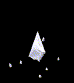 | 619 | EF_HYOUSENSOU | Lightning Spear Of Ice |
|  | 620 | EF_BOTTOM_SUITON | Water Escape Technique |
|  | 621 | EF_STIN4 | Wind Blade |
| 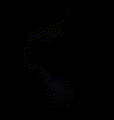 | 622 | EF_THUNDERSTORM2 | Lightning Crash |
| 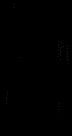 | 623 | EF_CHEMICAL4 | Piercing Shot |
|  | 624 | EF_STIN5 | Kamaitachi |
|  | 625 | EF_MADNESS_BLUE | Madness Canceller |
|  | 626 | EF_MADNESS_RED | Adjustment |
|  | 627 | EF_RG_COIN3 | Disarm (Sound Effect) |
| 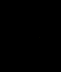 | 628 | EF_BASH3D5 | Dust |
|  | 629 | EF_CHOOKGI3 | (Nothing) |
| 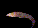 | 630 | EF_KIRIKAGE | Shadow Slash |
| 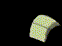 | 631 | EF_TATAMI | Reverse Tatami Map Unit |
| 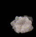 | 632 | EF_KASUMIKIRI | Mist Slash |
|  | 633 | EF_ISSEN | Final Strike |
|  | 634 | EF_KAEN | Crimson Fire Formation |
|  | 635 | EF_BAKU | Dragon Fire Formation |
| 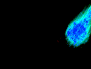 | 636 | EF_HYOUSYOURAKU | Falling Ice Pillar |
| 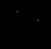 | 637 | EF_DESPERADO | Desperado |
|  | 638 | EF_LIGHTNING_S | Ground Drift Grenade |
|  | 639 | EF_BLIND_S | Ground Drift Grenade |
|  | 640 | EF_POISON_S | Ground Drift Grenade |
|  | 641 | EF_FREEZING_S | Ground Drift Grenade |
|  | 642 | EF_FLARE_S | Ground Drift Grenade |
| 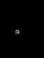 | 643 | EF_RAPIDSHOWER | Rapid Shower |
|  | 644 | EF_MAGICALBULLET | Magic Bullet |
| 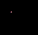 | 645 | EF_SPREADATTACK | Spread Attack |
| 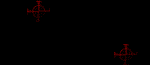 | 646 | EF_TRACKCASTING | Tracking (Shown While Casting) |
|  | 647 | EF_TRACKING | Tracking |
| 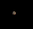 | 648 | EF_TRIPLEACTION | Triple Action |
| 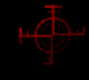 | 649 | EF_BULLSEYE | Bull's Eye |
