# Effects 700 - 750

|    | ID | Name | Desc |
|----|----|------|------|
| 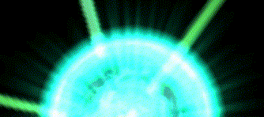 | 700 | EF_MAPSPHERE2 | Big Colored Green Sphere. |
|  | 701 | EF_GLOW11 | Huge Blue Sphere |
| 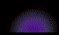 | 702 | EF_GLOW12 | Little Colored Violet Sphere |
| 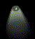 | 703 | EF_CIRCLELIGHT | Light Infiltration with fall of pownder |
|  | 704 | EF_ITEM315 | Client Error (mobile_ef02.str) |
|  | 705 | EF_ITEM316 | Client Error (mobile_ef01.str) |
|  | 706 | EF_ITEM317 | Client Error (mobile_ef03.str) |
|  | 707 | EF_ITEM318 | Client Crash :P |
| 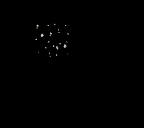 | 708 | EF_STORM_MIN | Storm Gust (same as 89) |
|  | 709 | EF_POK_JAP | A Firework that split in 4 mini fireworks |
| 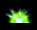 | 710 | EF_MAP_GREENLIGHT | A Sphere like Effect 701 but Green, and a bit more larger |
| 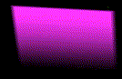 | 711 | EF_MAP_MAGICWALL | A big violet wall |
| 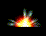 | 712 | EF_MAP_GREENLIGHT2 | A Little Flame Sphere |
|  | 713 | EF_YELLOWFLY1 | A lot of Very Small and Yellow Sphere |
|  | 714 | EF_YELLOWFLY2 | (Nothing) |
|  | 715 | EF_BOTTOM_BLUE | Little blue Basilica |
|  | 716 | EF_BOTTOM_BLUE2 | Same as 715 |
|  | 717 | EF_WEWISH | Christmas Carol (copy of Angelus) |
| 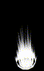 | 718 | EF_FIREPILLARON2 | Judex (Visual Effect) |
| 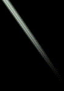 | 719 | EF_FORESTLIGHT5 | Renovatio (light beam) |
|  | 720 | EF_SOULBREAKER3 | Yellow version of Soul Breaker |
| 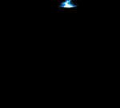 | 721 | EF_ADO_STR | Adoramus (lightning bolt) |
| 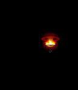 | 722 | EF_IGN_STR | Ignition Break (big explosion) |
|  | 723 | EF_CHIMTO2 | Hundred Spear (sound effect) |
| 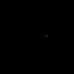 | 724 | EF_WINDCUTTER | Green version of Detecting |
| 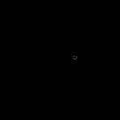 | 725 | EF_DETECT2 | Oratorio (like Detecting) |
| 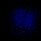 | 726 | EF_FROSTMYSTY | Frost Misty (blue vapor and bubbles) |
|  | 727 | EF_CRIMSON_STR | Crimson Rock |
| 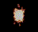 | 728 | EF_HELL_STR | Small fire (part of Hell Inferno) |
|  | 729 | EF_SPR_MASH | Marsh of Abyss (like Close Confine) |
|  | 730 | EF_SPR_SOULE | Small, cartoony explosion (part of Soul Expansion) |
| 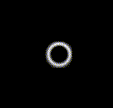 | 731 | EF_DHOWL_STR | Dragon Howling (blinking, expanding circle) |
|  | 732 | EF_EARTHWALL | Spike from the ground |
|  | 733 | EF_SOULBREAKER4 | Fluffy Ball flying by |
| 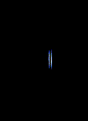 | 734 | EF_CHAINL_STR | Chain Lightning |
|  | 735 | EF_CHOOKGI_FIRE | (Nothing) |
|  | 736 | EF_CHOOKGI_WIND | (Nothing) |
|  | 737 | EF_CHOOKGI_WATER | (Nothing) |
|  | 738 | EF_CHOOKGI_GROUND | (Nothing) |
|  | 739 | EF_MAGENTA_TRAP | Old Magenta Trap |
|  | 740 | EF_COBALT_TRAP | Old Cobald Trap |
|  | 741 | EF_MAIZE_TRAP | Old Maize Trap |
|  | 742 | EF_VERDURE_TRAP | Old Verdure Trap |
|  | 743 | EF_NORMAL_TRAP | White Ranger Trap |
|  | 744 | EF_CLOAKING2 | Camouflage |
|  | 745 | EF_AIMED_STR | Aimed Bolt (crosshairs) |
|  | 746 | EF_ARROWSTORM_STR | Arrow Storm |
|  | 747 | EF_LAULAMUS_STR | Falling white feathers |
| 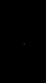 | 748 | EF_LAUAGNUS_STR | Falling blue feathers |
| 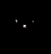 | 749 | EF_MILSHIELD_STR | Millennium Shield |
