# Effects 800 - 850

|    | ID | Name | Desc |
|----|----|------|------|
|  | 800 | EF_REDLINE | Hell Inferno (red lights) |
|  | 801 | EF_FROSTDIVER3 | Jack Frost unit (ice spikes) |
|  | 802 | EF_BOTTOM_BASILICA2 | White Imprison |
|  | 803 | EF_RECOGNIZED | Recognized Spell |
|  | 804 | EF_TETRA | Tetra Vortex [S] |
|  | 805 | EF_TETRACASTING | Tetra Vortex cast animation (blinking colors) |
|  | 806 | EF_FIREBALL3 | Flying by as fast as a rocket |
|  | 807 | EF_INTIMIDATE3 | Kidnapping sound |
|  | 808 | EF_RECOGNIZED2 | Like Recognized Spell, but one symbol |
|  | 809 | EF_CLOAKING3 | Shadowy filter [S] |
|  | 810 | EF_INTIMIDATE4 | Damp thud sound [S] |
| 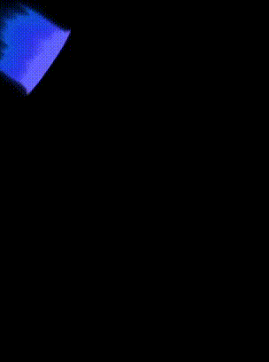 | 811 | EF_STRETCH | Body Painting |
|  | 812 | EF_BLACKBODY | Black expanding aura |
|  | 813 | EF_ENERVATION | Masquerade - Enervation |
|  | 814 | EF_ENERVATION2 | Masquerade - Groomy |
|  | 815 | EF_ENERVATION3 | Masquerade - Ignorance |
|  | 816 | EF_ENERVATION4 | Masquerade - Laziness |
|  | 817 | EF_ENERVATION5 | Masquerade - Unlucky |
|  | 818 | EF_ENERVATION6 | Masquerade - Weakness |
|  | 819 | EF_LINELINK4 | (Nothing) |
|  | 820 | EF_RG_COIN5 | Strip Accessory |
|  | 821 | EF_WATERFALL_ANI | Waterfall |
| 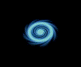 | 822 | EF_BOTTOM_MANHOLE | Dimension Door (spinning blue aura) |
|  | 823 | EF_MANHOLE | in-the-manhole effect |
|  | 824 | EF_MAKEFEINT | Some filter |
|  | 825 | EF_FORESTLIGHT6 | Dimension Door (aura + blue light) |
|  | 826 | EF_DARKCASTING2 | Expanding black casting anim. |
|  | 827 | EF_BOTTOM_ANI | Chaos Panic (spinning brown aura) |
|  | 828 | EF_BOTTOM_MAELSTROM | Maelstrom (spinning pink aura) |
|  | 829 | EF_BOTTOM_BLOODYLUST | Bloody Lust (spinning red aura) |
|  | 830 | EF_BEGINSPELL_N1 | Blue aura (Arch Bishop cast animation) |
| 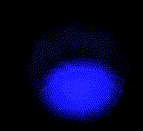 | 831 | EF_BEGINSPELL_N2 | Blue cone [S] |
|  | 832 | EF_HEAL_N | Sonic Wave |
|  | 833 | EF_CHOOKGI_N | (Nothing) |
|  | 834 | EF_JOBLVUP50_2 | Light shooting away circlish |
| 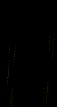 | 835 | EF_CHEMICAL2DASH2 | Fastness yellow-reddish |
|  | 836 | EF_CHEMICAL2DASH3 | Fastness yellow-pinkish |
|  | 837 | EF_ROLLINGCAST | Casting [S] |
| 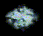 | 838 | EF_WATER_BELOW | Watery aura |
|  | 839 | EF_WATER_FADE | [Client Error] |
| 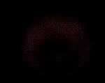 | 840 | EF_BEGINSPELL_N3 | Red cone |
| 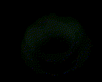 | 841 | EF_BEGINSPELL_N4 | Green cone |
| 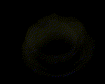 | 842 | EF_BEGINSPELL_N5 | Yellow cone |
| 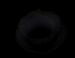 | 843 | EF_BEGINSPELL_N6 | White cone |
| 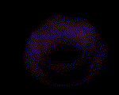 | 844 | EF_BEGINSPELL_N7 | Purple cone |
| 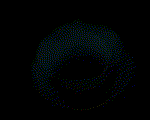 | 845 | EF_BEGINSPELL_N8 | light-bluish turquoise cone |
| 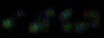 | 846 | EF_WATER_SMOKE | (Nothing) |
| 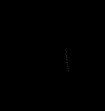 | 847 | EF_DANCE1 | Gloomy Day (white/red light rays) |
|  | 848 | EF_DANCE2 | Gloomy Day (white/blue light rays) |
|  | 849 | EF_LINKPARTICLE | (Nothing) |
