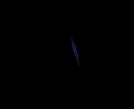

# Effects 850 - 900

|    | ID | Name | Desc |
|----|----|------|------|
|  | 850 | EF_SOULLIGHT2 | (Nothing) |
|  | 851 | EF_SPR_PARTICLE | Green mushy-foggy stuff (dull) |
|  | 852 | EF_SPR_PARTICLE2 | Green mushy-foggy stuff (bright) |
|  | 853 | EF_SPR_PLANT | Bright green flower area |
|  | 854 | EF_CHEMICAL_V | Blue beam of light with notes |
|  | 855 | EF_SHOOTPARTICLE | (Nothing) |
|  | 856 | EF_BOT_REVERB | Reverberation (red eighth notes) |
|  | 857 | EF_RAIN_PARTICLE | Severe Rainstorm (falling red and blue beams) |
|  | 858 | EF_CHEMICAL_V2 | Deep Sleep Lullaby (two red beams and music notes) |
|  | 859 | EF_SECRA | Holograph of text (blue) |
|  | 860 | EF_BOT_REVERB2 | Distorted note (blue) |
|  | 861 | EF_CIRCLEPOWER2 | Green aura (from Circle of Life's Melody) |
|  | 862 | EF_SECRA2 | Randomize Spell (holograph of text) |
|  | 863 | EF_CHEMICAL_V3 | Dominion Impulse (two spears of light) |
|  | 864 | EF_ENERVATION7 | Gloomy Day (colorful lines) |
|  | 865 | EF_CIRCLEPOWER3 | Blue aura (from Song of Mana) |
|  | 866 | EF_SPR_PLANT2 | Dance with a Warg (Wargs) |
|  | 867 | EF_CIRCLEPOWER4 | Yellow aura (from Dance with a Warg) |
|  | 868 | EF_SPR_PLANT3 | Song of Mana (Violies) |
|  | 869 | EF_RG_COIN6 | Strip sound [S] |
|  | 870 | EF_SPR_PLANT4 | Ghostly Succubuses of fire |
|  | 871 | EF_CIRCLEPOWER5 | Red aura (from Lerad's Dew) |
|  | 872 | EF_SPR_PLANT5 | Lerad's Dew (Minerals) |
|  | 873 | EF_CIRCLEPOWER6 | Stargate-wormhole stuff (bright purple) |
|  | 874 | EF_SPR_PLANT6 | Melody of Sink (Ktullanuxes) |
|  | 875 | EF_CIRCLEPOWER7 | Stargate-wormhole stuff (bright turquoise) |
|  | 876 | EF_SPR_PLANT7 | Warcry of Beyond (Garms) |
|  | 877 | EF_CIRCLEPOWER8 | Stargate-wormhole stuff (white) |
|  | 878 | EF_SPR_PLANT8 | Unlimited Humming Voice (Miyabi Ningyos) |
|  | 879 | EF_HEARTASURA | Siren's Voice (heart-like) |
|  | 880 | EF_BEGINSPELL_150 | Bluish castish cone |
|  | 881 | EF_LEVEL99_150 | Blue aura |
|  | 882 | EF_PRIMECHARGE | Whirl of fireflies (red) |
|  | 883 | EF_GLASSWALL4 | Epiclesis (transparent green tree) |
|  | 884 | EF_GRADIUS_LASER | Green beam |
|  | 885 | EF_BASH3D6 | Blue light beams |
|  | 886 | EF_GUMGANG5 | Blue castish cone |
|  | 887 | EF_HITLINE8 | Wavy sparks |
|  | 888 | EF_ELECTRIC4 | Earth Shaker (same as 432) |
|  | 889 | EF_TEIHIT1T | Fast light beams |
|  | 890 | EF_SPINMOVE | Rotation |
|  | 891 | EF_FIREBALL4 | Magic shots [S] |
|  | 892 | EF_TRIPLEATTACK4 | Fastness with hitting sound[S] |
|  | 893 | EF_CHEMICAL3S | Blue-white light passing by |
|  | 894 | EF_GROUNDSHAKE | (Nothing) |
|  | 895 | EF_DQ9_CHARGE | Big wheel of flat light beams |
|  | 896 | EF_DQ9_CHARGE2 | Still sun shaped lightning aura |
|  | 897 | EF_DQ9_CHARGE3 | Animated sun shaped lightning aura |
|  | 898 | EF_DQ9_CHARGE4 | Animated, curvy sun shaped lightning aura |
|  | 899 | EF_BLUELINE | White/red light shots from below |
