# Effects 900 - 950

|    | ID | Name | Desc |
|----|----|------|------|
| 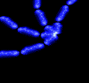 | 900 | EF_SELFSCROLL | Animated, slow curvy sun shaped lightning aura |
|  | 901 | EF_SPR_LIGHTPRINT | Explosion |
|  | 902 | EF_PNG_TEST | Floating bedtable texture |
| 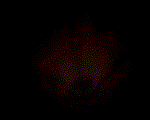 | 903 | EF_BEGINSPELL_YB | Castish flamey cone |
| 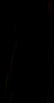 | 904 | EF_CHEMICAL2DASH4 | Yellow/pink lights passing by |
|  | 905 | EF_GROUNDSHAKE2 | Expanding circle |
|  | 906 | EF_PRESSURE2 | Shield Press (falling shield) |
|  | 907 | EF_RG_COIN7 | Chainy, metalish sound [S] |
|  | 908 | EF_PRIMECHARGE2 | Prestige (sphere of yellow particles) |
|  | 909 | EF_PRIMECHARGE3 | Banding (sphere of red particles) |
| 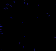 | 910 | EF_PRIMECHARGE4 | Inspiration (sphere of blue particles) |
| 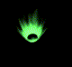 | 911 | EF_GREENCASTING | Green castish animation [S] |
| 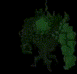 | 912 | EF_WALLOFTHORN | Wall of Thorns unit (green fog cloud) |
|  | 913 | EF_FIREBALL5 | Magic projectiles |
|  | 914 | EF_THROWITEM11 | (Nothing) |
| 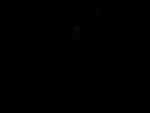 | 915 | EF_SPR_PLANT9 | Crazy Weed |
| 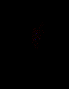 | 916 | EF_DEMONICFIRE | Demonic Fire |
| 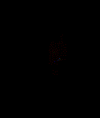 | 917 | EF_DEMONICFIRE2 | More angry, demonic flames |
| 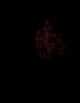 | 918 | EF_DEMONICFIRE3 | Fire Insignia (demonic flames) |
| 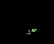 | 919 | EF_HELLSPLANT | Hell's Plant (green snapping plant) |
| 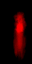 | 920 | EF_FIREWALL2 | Fire Walk unit |
| 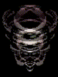 | 921 | EF_VACUUM | Vacuum Extreme (whirlwind) |
| 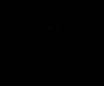 | 922 | EF_SPR_PLANT10 | Psychic Wave |
| 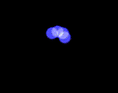 | 923 | EF_SPR_LIGHTPRINT2 | Poison Buster |
|  | 924 | EF_POISONSMOKE2 | Poisoning animation |
|  | 925 | EF_MAKEHALLU2 | Some filter |
| 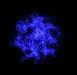 | 926 | EF_SHOCKWAVE2 | Electric Walk unit |
|  | 927 | EF_SPR_PLANT11 | Earth Grave (speary roots) |
|  | 928 | EF_COLDTHROW2 | Ice cloud projectiles |
| 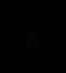 | 929 | EF_DEMONICFIRE4 | Warmer (field of flames) |
| 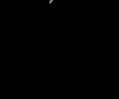 | 930 | EF_PRESSURE3 | Varetyr Spear (falling spear) |
| 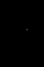 | 931 | EF_LINKPARTICLE2 | (Nothing) |
|  | 932 | EF_SOULLIGHT3 | Firefly |
|  | 933 | EF_CHAREFFECT | [Client Crash] |
| 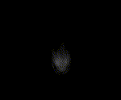 | 934 | EF_GUMGANG6 | White, castishly expanding cone |
| 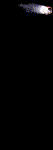 | 935 | EF_FIREBALL6 | Green magic projectile |
|  | 936 | EF_GUMGANG7 | Red, castishly expanding cone |
| 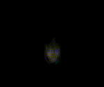 | 937 | EF_GUMGANG8 | Yellow, castishly expanding cone |
| 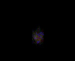 | 938 | EF_GUMGANG9 | Dark-red, castishly expanding cone |
| 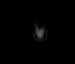 | 939 | EF_BOTTOM_DE2 | Blue, conish aura |
|  | 940 | EF_COLDSTATUS | Snow flake |
|  | 941 | EF_SPR_LIGHTPRINT3 | Explosion of red, demonic fire |
| 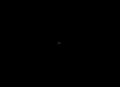 | 942 | EF_WATERBALL3 | Expanding, white dome |
|  | 943 | EF_HEAL_N2 | Green, fluffy projectile |
|  | 944 | EF_RAIN_PARTICLE2 | Falling gems |
|  | 945 | EF_CLOUD9 | (Nothing) |
| 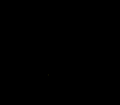 | 946 | EF_YELLOWFLY3 | Floating lights |
|  | 947 | EF_EL_GUST | Blue lightning sphere |
| 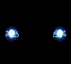 | 948 | EF_EL_BLAST | Two blue lightning spheres |
| 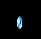 | 949 | EF_EL_AQUAPLAY | Flat, spinning diamond |
