# Effects 950 - 1000

|    | ID | Name | Desc |
|----|----|------|------|
| 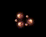 | 950 | EF_EL_UPHEAVAL | Circling, planetlike spheres |
| 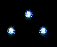 | 951 | EF_EL_WILD_STORM | Three lightning spheres |
| 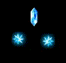 | 952 | EF_EL_CHILLY_AIR | Flat, spinning gem and two lightning spheres |
|  | 953 | EF_EL_CURSED_SOIL | Spinning, planetlike spheres |
|  | 954 | EF_EL_COOLER | Two lightblue glowing spheres |
| 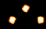 | 955 | EF_EL_TROPIC | Three spinning flame spheres |
| 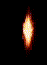 | 956 | EF_EL_PYROTECHNIC | Flame |
| 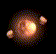 | 957 | EF_EL_PETROLOGY | Spinning planetlike sphere |
| 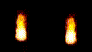 | 958 | EF_EL_HEATER | Two flames |
|  | 959 | EF_POISON_MIST | Purple flame |
| 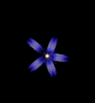 | 960 | EF_ERASER_CUTTER | Small yellow explosion |
| 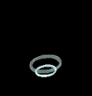 | 961 | EF_SILENT_BREEZE | Cartoony whirlwind |
|  | 962 | EF_MAGMA_FLOW | Rising fire |
|  | 963 | EF_GRAYBODY | Dark filter (like Stone Curse) |
|  | 964 | EF_LAVA_SLIDE | Same as 920 |
| 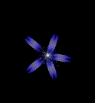 | 965 | EF_SONIC_CLAW | Small white explosion |
| 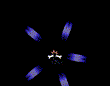 | 966 | EF_TINDER_BREAKER | Bone crack |
|  | 967 | EF_MIDNIGHT_FRENZY | Another little explosion |
|  | 968 | EF_MACRO |  |
| 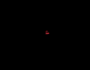 | 969 | EF_CHEMICAL_ALLRANGE |  |
|  | 970 | EF_TETRA_FIRE |  |
|  | 971 | EF_TETRA_WATER |  |
|  | 972 | EF_TETRA_WIND |  |
|  | 973 | EF_TETRA_GROUND |  |
| 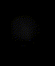 | 974 | EF_EMITTER |  |
| 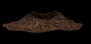 | 975 | EF_VOLCANIC_ASH |  |
| 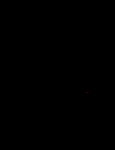 | 976 | EF_LEVEL99_ORB1 |  |
| 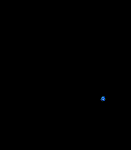 | 977 | EF_LEVEL99_ORB2 |  |
| 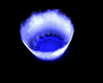 | 978 | EF_LEVEL150 |  |
|  | 979 | EF_LEVEL150_SUB |  |
|  | 980 | EF_THROWITEM4_1 |  |
| 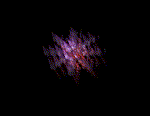 | 981 | EF_THROW_HAPPOKUNAI |  |
| 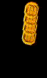 | 982 | EF_THROW_MULTIPLE_COIN |  |
|  | 983 | EF_THROW_BAKURETSU |  |
|  | 984 | EF_ROTATE_HUUMARANKA |  |
|  | 985 | EF_ROTATE_BG |  |
| 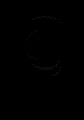 | 986 | EF_ROTATE_LINE_GRAY |  |
|  | 987 | EF_2011RWC |  |
| 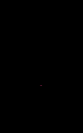 | 988 | EF_2011RWC2 |  |
|  | 989 | EF_KAIHOU |  |
| 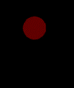 | 990 | EF_GROUND_EXPLOSION |  |
| 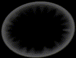 | 991 | EF_KG_KAGEHUMI |  |
| 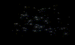 | 992 | EF_KO_ZENKAI_WATER |  |
| 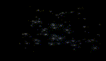 | 993 | EF_KO_ZENKAI_LAND |  |
| 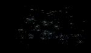 | 994 | EF_KO_ZENKAI_FIRE |  |
| 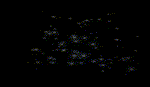 | 995 | EF_KO_ZENKAI_WIND |  |
| 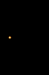 | 996 | EF_KO_JYUMONJIKIRI |  |
|  | 997 | EF_KO_SETSUDAN |  |
| 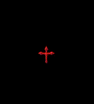 | 998 | EF_RED_CROSS |  |
|  | 999 | EF_KO_IZAYOI |  |
